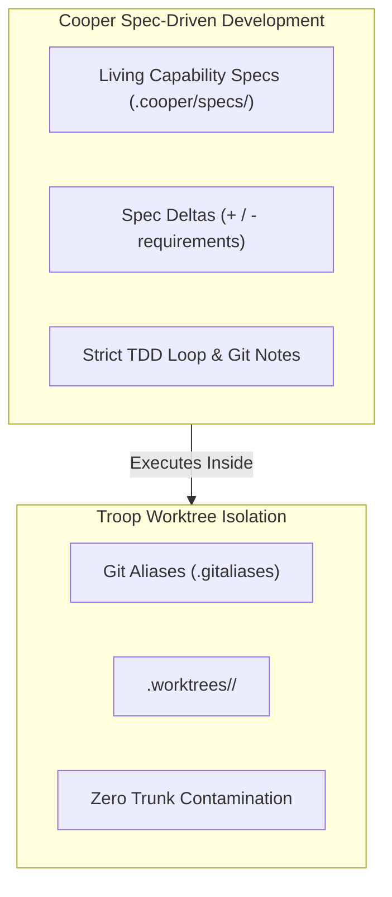

# Cooper SDD Integration

[Troop](https://github.com/twoBoots/troop) acts as the fundamental worktree isolation engine powering [Cooper](https://github.com/twoBoots/cooper), an autonomous Spec-Driven Development (SDD) framework.

---

## Why Cooper Relies on Troop

Autonomous AI agents executing complex software engineering initiatives face two major challenges:
1. **Context Drift**: Hallucinating requirements or drifting from intended architecture.
2. **Workspace Pollution**: Making unverified changes directly on the main branch or stomping over concurrent tasks.

Cooper addresses context drift through **Living Capability Specifications** (`.cooper/specs/`) and explicit requirement diffs (Spec Deltas). 

To solve workspace pollution, Cooper delegates entirely to **Troop** for complete file-level worktree isolation.

---

## Architecture Synergy



---

## How Cooper Installs Troop

When Cooper is installed via its one-line installer:

```bash
curl -fsSL https://raw.githubusercontent.com/twoBoots/cooper/main/install.sh | bash
```

The installer runs Troop's installation pipeline:
1. Executes Troop's installer to configure `.gitaliases` (`git agent-start`, `git agent-stop`, `git troop`).
2. Configures `.gitignore` to ignore the `.worktrees/` directory.
3. Relocates `TROOP.md` into `.cooper/TROOP.md` to maintain a clean project root.
4. Extends `AGENTS.md` with guidelines instructing AI agents to always operate inside Troop worktrees.

---

## Workflow Integration

When working on a Cooper track, agent skills map directly onto Troop commands:

| Cooper Phase | Agent Skill | Troop Command | Description |
| :--- | :--- | :--- | :--- |
| **Track Initialization** | `cooper-new-track` | `git agent-start <track_id>` | Creates isolated tree at `.worktrees/<track_id>` and checks out `<track_id>` |
| **Implementation** | `cooper-implement` | `cd .worktrees/<track_id>` | Executes TDD loop and Git Notes metadata inside the isolated worktree |
| **Status Overview** | `cooper-status` | `git troop` | Lists all active tracks and monkeys across trees |
| **Review & Archival** | `cooper-review` | `git agent-stop <track_id>` | Archives track into `.cooper/archive/<track_id>/` and cleanly deletes worktree |

---

## References

- [Cooper Repository](https://github.com/twoBoots/cooper)
- [Cooper Documentation](https://twoboots.github.io/cooper/)
- [Troop Repository](https://github.com/twoBoots/troop)
- [Troop Workflow Guide](./guide/workflow.md)
