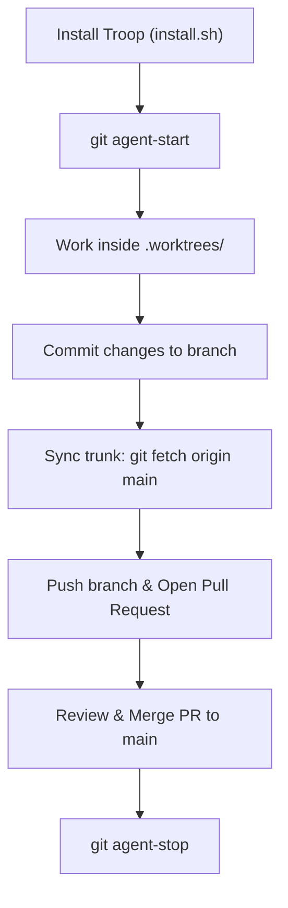

# Troop Workflow & Lifecycle

The [Troop](https://github.com/twoBoots/troop) workflow is designed to support concurrent software engineering where human engineers and autonomous AI agents collaborate in isolated branches without interfering with each other's workspaces.

---

## The Complete Lifecycle



---

## 1. Initialization
When setting up a new repository or onboarding a new project, run:

```bash
curl -fsSL https://raw.githubusercontent.com/twoboots/troop/main/install.sh | bash
```

This installs `.gitaliases`, updates the Git configuration to include `.gitaliases`, appends `.worktrees/` to `.gitignore`, downloads `TROOP.md`, and injects guidelines into `AGENTS.md`.

---

## 2. Spawning a Worktree (`agent-start`)

Whenever an agent or developer picks up a new task:

```bash
git agent-start user-billing
```

What occurs behind the scenes:
1. `git fetch origin main` synchronizes your local repository with upstream changes.
2. The base commit is resolved to `origin/main` (or local `main` if offline).
3. `git worktree add .worktrees/user-billing -b user-billing $BASE` creates an ephemeral tree directory with its own independent `HEAD` and staging index.

---

## 3. Working in Trees

Navigate into the worktree:

```bash
cd .worktrees/user-billing
```

Because `.worktrees/user-billing` is an independent working copy linked to the central `.git/` object store:
- No files are locked or shared between trees.
- Parallel test runners or build daemons run without conflicting ports or file locks.
- The root workspace remains 100% clean.

To check on all parallel monkeys working across the repository:

```bash
git troop
```

---

## 4. Trunk Synchronization

Before opening a pull request, synchronize your worktree branch with latest `main`:

```bash
git fetch origin main
git rebase origin/main
```

Resolve any conflicts inside the worktree environment, ensuring that the main repository workspace remains unblocked.

---

## 5. Review & Pull Request

Push the task branch to remote:

```bash
git push -u origin user-billing
```

Open a pull request via GitHub CLI:

```bash
gh pr create --title "feat(billing): add stripe webhook handler" --body "..."
```

---

## 6. Teardown (`agent-stop`)

Once the pull request has been merged into `main`:

```bash
cd /path/to/project-root
git agent-stop user-billing
```

This command:
1. Safely removes the worktree directory `.worktrees/user-billing`.
2. Deletes the local branch `user-billing`.

---

## Concurrency Patterns

### Multi-Agent Parallelism
Multiple autonomous AI agents can be assigned independent tasks simultaneously:
- Agent 1 works in `.worktrees/task-1-auth`
- Agent 2 works in `.worktrees/task-2-reporting`
- Agent 3 works in `.worktrees/task-3-search`

Each agent can test, run build pipelines, and commit independently without race conditions.

### Human & Agent Pairing
A human developer can inspect an agent's work at any time by simply navigating into `.worktrees/<task-name>`, reviewing unstaged edits, running tests, or offering interactive feedback.

When coupled with Spec-Driven Development, explore how Troop powers the [Cooper SDD Framework](../cooper-integration.md).
