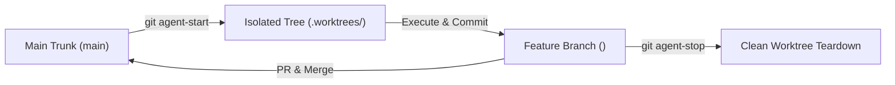

## Quickstart

Install Troop into any Git repository with a single command:

```bash
curl -fsSL https://raw.githubusercontent.com/twoboots/troop/main/install.sh | bash
```

Alternatively, run from a local clone of Troop:

```bash
/path/to/troop/install.sh /path/to/your-project
```

---

## Core Git Commands

Troop exposes three focused Git aliases designed for maximum developer ergonomics:

| Command | Purpose |
| :--- | :--- |
| `git agent-start <task-name>` | Spawns an isolated tree in `.worktrees/<task-name>` on branch `<task-name>` |
| `git troop` | Lists all active monkeys working in trees across the repository |
| `git agent-stop <task-name>` | Safely tears down the worktree and deletes the local branch after merge |

---

## The Troop Lifecycle



1. **Spawn Tree (`git agent-start <task-name>`)**: Fetches latest `origin/main`, creates `.worktrees/<task-name>`, and checks out a new branch.
2. **Climb into Tree**: Monkeys navigate into `.worktrees/<task-name>` and develop in complete isolation without trunk pollution.
3. **List Active Trees (`git troop`)**: See all monkeys currently working in trees.
4. **Merge & Teardown (`git agent-stop <task-name>`)**: Once changes are merged, safely remove the worktree and prune the local branch.

---

## Learn More

- [Getting Started Guide](./guide/getting-started.md)
- [Workflow & Lifecycle Details](./guide/workflow.md)
- [Architecture Deep Dive](./architecture.md)
- [Installation Guide](./installation.md)
- [Cooper SDD Integration](./cooper-integration.md)
