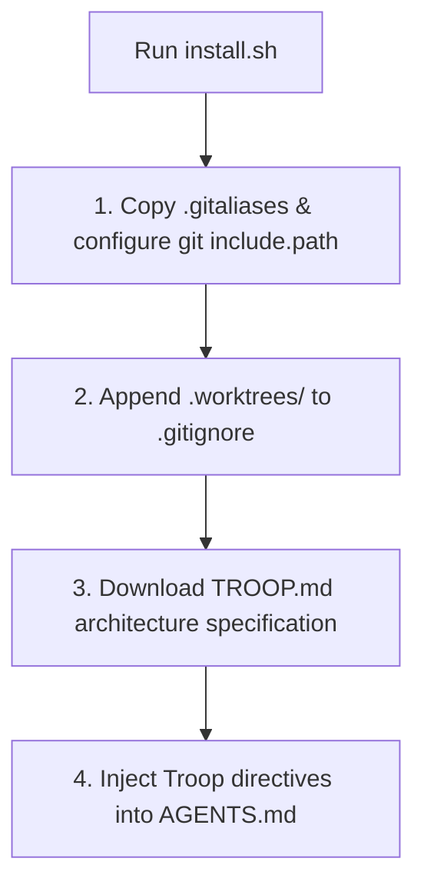

# Troop Installation & Setup Guide

[Troop](https://github.com/twoBoots/troop) can be installed into any existing or new Git repository in seconds via the automated installer or manual configuration.

---

## One-Line Installation

Navigate to the root of your target Git project and run:

```bash
curl -fsSL https://raw.githubusercontent.com/twoboots/troop/main/install.sh | bash
```

Alternatively, if you have cloned the [Troop](https://github.com/twoBoots/troop) repository locally:

```bash
/path/to/troop/install.sh /path/to/your-project
```

---

## What `install.sh` Does

The `install.sh` script coordinates the four foundational components of the Troop architecture:



### 1. Configure Git Aliases
- Fetches or copies `.gitaliases` into the project root.
- Runs `git config include.path ../.gitaliases` to register `agent-start`, `agent-stop`, and `troop` within the repository's local Git configuration.

### 2. Ignore Worktrees
- Checks whether `.gitignore` exists.
- Appends `.worktrees/` if not already present, ensuring temporary tree workspaces are never committed to the repository.

### 3. Install Architecture Specification
- Copies `TROOP.md` into the project root as an in-repo reference for human developers and autonomous AI agents.

### 4. Inject Operational Rules into `AGENTS.md`
- If `AGENTS.md` exists, appends standard Troop rules if not already present.
- If `AGENTS.md` does not exist, copies `AGENTS.template.md` as `AGENTS.md`.

---

## Manual Installation

In air-gapped or restricted environments, you can manually configure Troop:

1. **Create `.gitaliases`** in your repository root:
   ```ini
   [alias]
       agent-start = "!f() { git fetch origin main 2>/dev/null || true; BASE=$({ git rev-parse --verify origin/main 2>/dev/null || git rev-parse --verify main; }); git worktree add .worktrees/$1 -b $1 $BASE; }; f"
       agent-stop = "!f() { git worktree remove .worktrees/$1 && git branch -d $1; }; f"
       troop = worktree list
   ```

2. **Register `.gitaliases` in local Git configuration**:
   ```bash
   git config include.path ../.gitaliases
   ```

3. **Add `.worktrees/` to `.gitignore`**:
   ```bash
   echo -e "\n# Troop Worktrees\n.worktrees/" >> .gitignore
   ```

4. **Verify Setup**:
   ```bash
   git troop
   ```

---

## Integration with Cooper

If your project utilizes Spec-Driven Development via [Cooper](https://github.com/twoBoots/cooper), running Cooper's installer automatically invokes Troop's setup and configures worktrees natively. See the [Cooper Integration Guide](./cooper-integration.md).
